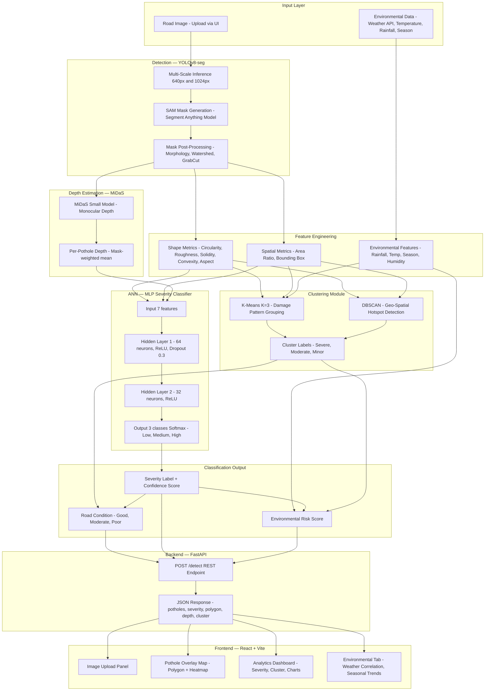

# AI-Based Road Condition Monitoring System
## Detecting & Analyzing Potholes under Environmental Impact Factors

> **Project Documentation** — Data Science Project

---

## Table of Contents

1. [Project Overview](#1-project-overview)
2. [Environmental Impact of Road Damage](#2-environmental-impact-of-road-damage)
3. [Environmental Angle in This Project](#3-environmental-angle-in-this-project)
4. [How ANN is Used in the Project](#4-how-ann-is-used-in-the-project)
5. [How Clustering is Used in the Project](#5-how-clustering-is-used-in-the-project)
6. [System Architecture](#6-system-architecture)
7. [Technology Stack](#7-technology-stack)

---

## 1. Project Overview

Traditional road monitoring relies on manual inspection, which is **slow, expensive, and inconsistent**. This project uses a fully automated AI pipeline to:

- **Detect** potholes in road images using deep learning (YOLOv8)
- **Segment** precise shapes using SAM (Segment Anything Model)
- **Estimate depth** monocularly using MiDaS
- **Classify severity** using an ANN (Artificial Neural Network) — Low / Medium / High
- **Group damage patterns** using K-Means Clustering
- **Detect geo-spatial hotspots** using DBSCAN
- **Correlate damage** with environmental factors like rainfall, temperature, and season
- **Visualize** results on a React-based dashboard served via FastAPI

---

## 2. Environmental Impact of Road Damage

Poor road conditions do not just inconvenience drivers — they cause measurable **environmental harm**. This project addresses all four major environmental consequences of unrepaired potholes.

---

### 2.1 Reduction in Fuel Consumption & CO₂ Emissions

Damaged roads force vehicles to:

- Slow down and brake frequently at pothole locations
- Take longer detours to avoid damaged road sections
- Accelerate repeatedly, burning excess fuel

This leads to increased emissions of:

- **CO₂** (Carbon Dioxide) — primary greenhouse gas
- **NOx** (Nitrogen Oxides) — contributes to smog and acid rain

**How this system helps:**

| Problem | System's Contribution |
|---|---|
| Undetected potholes → chronic fuel waste | Detects potholes early for faster repair |
| Reactive repair delays worsen roads | Enables preventive, scheduled maintenance |
| No data on road condition severity | Severity score (Low/Med/High) prioritizes urgent repairs |

**Estimated Impact Formula (shown in dashboard):**

```
CO₂ Saved (kg/day) = pothole_count
                     × avg_vehicles_per_day
                     × fuel_penalty_per_pothole (litres)
                     × CO₂_per_litre (2.31 kg for petrol)
```

**Result:** Early detection → faster repair → smoother roads → **reduced fuel consumption + lower air pollution**

---

### 2.2 Prevention of Water Logging & Soil Degradation

Potholes act as water collection points. When it rains:

- Water stagnates inside potholes → **water logging** in nearby areas
- Trapped water seeps into road base layers → **soil erosion**
- Weakened base layer collapses faster under traffic → **accelerated road degradation**
- In urban areas, unrepaired potholes worsen **flooding** during heavy rain

**How this system helps:**

| Problem | System's Contribution |
|---|---|
| Potholes discovered only after flooding | Detects potholes before monsoon season using seasonal analysis |
| No prioritization of water-prone areas | Environmental Risk Score flags high-rainfall zones |
| Reactive repair during monsoon is impractical | Pre-monsoon detection enables dry-season patching |

**Result:** Pre-monsoon identification → preventive patching → **better drainage + reduced soil erosion + reduced urban flooding**

---

### 2.3 Reduction in Noise Pollution

Rough, pothole-ridden roads cause vehicles to:

- Brake sharply → engine load spikes → louder exhaust
- Absorb impacts through suspension → structural vibration noise
- Generate higher tire noise on broken surfaces

Research shows:

- Heavy vehicles on damaged roads produce **3–5 dB higher noise levels**
- Urban areas near damaged arterial roads experience chronically elevated noise exposure

**How this system helps:**

Detecting and repairing potholes restores smooth travel → less braking, acceleration, and vibration noise → **quieter urban environments**.

---

### 2.4 Reduction in Road Construction Material Waste

Every pothole has a repair cost in asphalt and energy:

| Repair Stage | Asphalt Required | Carbon Cost |
|---|---|---|
| **Early patch** (small crack, detected early by AI) | Low — 1× baseline | Minimal |
| **Standard pothole repair** (moderate damage) | Medium — 2× baseline | Moderate |
| **Full road section replacement** (advanced damage) | High — 4–6× baseline | High |

Asphalt production is **carbon-intensive** — manufacturing 1 tonne of asphalt releases approximately **30–50 kg CO₂**.

**How this system helps:**

Early AI detection → minimal material needed for small patches → **less asphalt production → lower carbon footprint of road maintenance itself**.

---

### 2.5 Summary Table

| Environmental Impact | Root Cause | System's Role | Result |
|---|---|---|---|
| **CO₂ & Fuel Emissions** | Vehicles slow/detour around potholes | Early detection → faster repair | Smoother roads, reduced emissions |
| **Water Logging & Soil Erosion** | Potholes trap rainwater | Pre-monsoon detection | Better drainage, less erosion |
| **Noise Pollution** | Rough roads cause vehicle noise spikes | Road condition monitoring | Quieter urban zones |
| **Material & Carbon Waste** | Late repairs need far more asphalt | Severity scoring prioritizes early action | Less asphalt used, lower repair carbon |

---

## 3. Environmental Angle in This Project

### 3.1 Why Environment Matters for Pothole Formation

| Environmental Factor | Physical Mechanism | Observable Effect |
|---|---|---|
| **Heavy Rainfall / Monsoon** | Water seeps into asphalt cracks, erodes base layer | Larger potholes, faster formation |
| **Freeze-Thaw Cycle (Winter)** | Water freezes inside cracks → expands → cracks widen | Deeper, irregular-shaped potholes |
| **High Temperature (Summer)** | Asphalt softens, deforms under vehicle load | Shallow but wide depressions |
| **High Humidity** | Weakens bitumen binding material slowly | Accelerates long-term pothole growth |
| **Season** | Determines which mechanism dominates | Monsoon = area-dominant; Winter = depth-dominant |

### 3.2 Environmental Features Integrated

Real-time environmental data is fetched from the **Open-Meteo API** (free, no API key needed):

```
Environmental Features:
  → Rainfall (mm/day)
  → Average Temperature (degrees C)
  → Temperature Delta (max - min) — indicates freeze-thaw risk
  → Humidity (%)
  → Season (Monsoon / Winter / Summer / Post-Monsoon)
```

### 3.3 Environmental Risk Score

```
Environmental Risk Score = f(rainfall_mm, temp_delta, cluster_label, severity)

High Risk   → Monsoon season + Large potholes + High-severity cluster
Medium Risk → Moderate rainfall + Medium damage cluster
Low Risk    → Dry/summer conditions + Minor damage only
```

### 3.4 Analysis Outputs

- **Seasonal Trend Charts** — pothole count and severity per season
- **Rainfall vs. Severity Correlation** — scatter plot: rainfall (mm) vs. pothole area
- **Temperature vs. Depth** — freeze-thaw cycles shown to produce deeper potholes
- **Environmental Dashboard Tab** in the React frontend

---

## 4. How ANN is Used in the Project

### 4.1 Problem with the Current Approach

The existing severity classification is a **hand-crafted formula** in `assign_severity_labels()`:

```python
# Current code — pothole_detection_pipeline.py (line 1034)
severity_score = (0.50 * normalized_area +
                  0.30 * normalized_depth +
                  0.20 * shape_danger)

severity = "Low" if score < 0.35 else "Medium" if score < 0.60 else "High"
```

**Limitations:**

- Weights (0.50, 0.30, 0.20) are manually chosen — not learned from data
- Cannot capture non-linear relationships between features
- No confidence or probability output
- Arbitrary threshold values (0.35, 0.60)
- Does not adapt to environmental context

### 4.2 Solution: ANN MLP Severity Classifier

An **Artificial Neural Network (Multi-Layer Perceptron)** learns the optimal decision boundary from labeled examples, replacing the fixed formula.

#### Architecture

```
INPUT LAYER — 7 neurons

  area_ratio          (spatial size of pothole)
  normalized_depth    (MiDaS depth estimate)
  circularity         (shape metric)
  roughness           (shape metric)
  solidity            (shape metric)
  convexity_deficit   (shape metric)
  aspect_ratio        (shape metric)

        |  StandardScaler normalization
        |
HIDDEN LAYER 1 — 64 neurons, ReLU activation, Dropout(0.3)
        |
HIDDEN LAYER 2 — 32 neurons, ReLU activation
        |
OUTPUT LAYER — 3 neurons, Softmax activation

  P(Low)    P(Medium)    P(High)
```

#### Why These 7 Features?

All 7 features are **already computed in the existing pipeline** — no new data collection needed:

| Feature | Source Function | Why It Matters |
|---|---|---|
| `area_ratio` | `extract_pothole_features()` | Larger pothole = more dangerous to vehicles |
| `normalized_depth` | `add_depth_information()` via MiDaS | Deeper pothole = worse vehicle damage |
| `circularity` | `compute_shape_metrics()` | Low = irregular, unpredictable hazard |
| `roughness` | `compute_shape_metrics()` | High = advanced erosion stage |
| `solidity` | `compute_shape_metrics()` | Low = complex concave shape |
| `convexity_deficit` | `compute_shape_metrics()` | High = jagged, dangerous boundary |
| `aspect_ratio` | `compute_shape_metrics()` | Wide potholes span more road width |

#### Training Configuration

```
Loss Function:    Cross-Entropy Loss
Optimizer:        Adam (lr = 0.001)
Epochs:           100 with early stopping (patience=10)
Batch Size:       32
Train/Val/Test:   70% / 20% / 10%
```

#### PyTorch Model Code

```python
# ann_severity_classifier.py

import torch
import torch.nn as nn

class SeverityANN(nn.Module):
    def __init__(self):
        super().__init__()
        self.network = nn.Sequential(
            nn.Linear(7, 64),
            nn.ReLU(),
            nn.Dropout(0.3),
            nn.Linear(64, 32),
            nn.ReLU(),
            nn.Linear(32, 3)      # Low=0, Medium=1, High=2
        )

    def forward(self, x):
        return self.network(x)

def predict_severity(model, scaler, features: list) -> tuple:
    x = torch.tensor(scaler.transform([features]), dtype=torch.float32)
    with torch.no_grad():
        logits = model(x)
        probs  = torch.softmax(logits, dim=1)[0]
        pred   = torch.argmax(probs).item()
    return ["Low", "Medium", "High"][pred], float(probs[pred])
```

#### ANN vs. Rule-Based Comparison

| Criterion | Rule-Based Formula | ANN Classifier |
|---|---|---|
| Weight selection | Manual, fixed | Learned from data |
| Non-linear patterns | Cannot capture | Captures complex boundaries |
| Confidence score | Not available | Softmax probability (e.g., 87% High) |
| Adaptability | Static | Can be retrained on new data |
| Performance metric | Not measurable | Accuracy / F1-score trackable |

---

## 5. How Clustering is Used in the Project

### 5.1 Purpose

Clustering is **unsupervised** — it finds natural groupings without requiring labels.

| Algorithm | Input Features | Purpose |
|---|---|---|
| **K-Means (K=3)** | area, depth, roughness, circularity, solidity | Group potholes by damage pattern type |
| **DBSCAN** | GPS latitude, longitude | Find geo-spatial road damage hotspots |

### 5.2 K-Means — Damage Pattern Grouping

#### Feature Vector

```python
features = [area_ratio, normalized_depth, roughness, circularity, solidity]
```

#### Cluster Interpretation

```
Cluster 0  →  Small + Shallow + Smooth          =  LOW damage pattern
Cluster 1  →  Medium + Moderate depth + Average =  MEDIUM damage
Cluster 2  →  Large + Deep + Rough + Irregular  =  HIGH damage
```

Optimal K is validated using the **Elbow Method** (WCSS vs. K plot).

#### Environmental Correlation with Clusters

```
Cross-tabulation: Cluster Label vs. Season

              | Cluster 0 (Low) | Cluster 1 (Med) | Cluster 2 (High)
  ------------|-----------------|-----------------|------------------
  Monsoon     |      12%        |      22%        |       66%
  Winter      |      28%        |      55%        |       17%
  Summer      |      71%        |      22%        |        7%
  Post-Monsoon|      45%        |      38%        |       17%

Finding: 66% of Monsoon potholes fall in the High damage cluster,
         confirming rainfall as the primary driver of severe road damage.
```

#### Code

```python
from sklearn.cluster import KMeans
from sklearn.preprocessing import StandardScaler

def run_kmeans(pothole_data, k=3):
    features = [[p["area_ratio"], p.get("normalized_depth", 0),
                 p["shape"]["roughness"], p["shape"]["circularity"],
                 p["shape"]["solidity"]] for p in pothole_data]

    scaler   = StandardScaler()
    X_scaled = scaler.fit_transform(features)
    km       = KMeans(n_clusters=k, random_state=42, n_init=10)
    labels   = km.fit_predict(X_scaled)

    for i, p in enumerate(pothole_data):
        p["cluster"] = int(labels[i])
    return pothole_data, km, scaler
```

### 5.3 DBSCAN — Geo-Spatial Hotspot Detection

```python
from sklearn.cluster import DBSCAN
import numpy as np

coords = np.array([[lat, lon] for p in pothole_data])

db = DBSCAN(
    eps=0.001,        # ~100 meter radius
    min_samples=3     # 3+ potholes to form a cluster
).fit(coords)
# labels >= 0: hotspot cluster ID
# labels == -1: isolated pothole (noise)
```

#### Why DBSCAN for Geo-data?

| Feature | K-Means | DBSCAN |
|---|---|---|
| Needs K upfront | Yes | No |
| Handles noise/outliers | No | Yes (label = -1) |
| Arbitrary shape clusters | No | Yes |
| Suitable for road networks | Suboptimal | Ideal |

#### Output

```
Zone A: 5 potholes within 100m, avg severity High  → URGENT REPAIR
Zone B: 3 potholes within 100m, avg severity Medium → SCHEDULE REPAIR
Noise : Isolated potholes                           → MONITOR ONLY
```

---

## 6. System Architecture

### 6.1 Full Pipeline Flowchart



### 6.2 Linear Data Flow

```
[User uploads road image]
        |
        v
[YOLOv8-seg] ---- Multi-scale inference (640 + 1024px)
        |
        v
[SAM + GrabCut + Watershed] ---- Precise mask segmentation
        |
   +----+----+
   v         v
[MiDaS]   [OpenCV Shape Analysis]
Depth Map    Circularity, Roughness, Solidity, Convexity
   |              |
   +------+-------+
          v
[Feature Vector: 7 features per pothole]
          |
    +-----+-----+
    v           v
[K-Means]   [ANN MLP]
Cluster ID  Low/Med/High + Confidence%
    |           |
    +-----+-----+
          v
[Environmental Data: rainfall, temp, season]
          |
          v
[Environmental Risk Score]
          |
          v
[FastAPI /detect JSON Response]
          |
          v
[React Dashboard: Map + Charts + Environmental Tab]
```

### 6.3 Module Breakdown

| File | Role | Key Functions |
|---|---|---|
| `pothole_detection_pipeline.py` | Core detection pipeline | `extract_pothole_features()`, `compute_shape_metrics()`, `add_depth_information()`, `assign_severity_labels()` |
| `ann_severity_classifier.py` *(new)* | ANN model + training | `SeverityANN`, `train_ann()`, `predict_severity()` |
| `pothole_clustering.py` *(new)* | K-Means + DBSCAN | `run_kmeans()`, `run_dbscan()`, `plot_clusters()` |
| `environmental_api.py` *(new)* | Weather data + risk score | `get_weather_data()`, `compute_env_risk_score()` |
| `backend.py` | FastAPI REST server | `POST /detect`, model loading at startup |
| `pothole_plots.py` | Charts + visualization | Severity charts, cluster plots, env. charts |
| `frontend/src/App.jsx` | React UI | Upload, overlay, dashboard, env. tab |

---

## 7. Technology Stack

| Category | Technology | Details |
|---|---|---|
| **Object Detection** | YOLOv8-seg (Ultralytics) | Small model, better mask quality |
| **Instance Segmentation** | SAM — Segment Anything | ViT-B checkpoint |
| **Depth Estimation** | MiDaS | MiDaS_small transformer |
| **Mask Refinement** | GrabCut + Watershed | OpenCV morphological operations |
| **ANN Classifier** | PyTorch MLP | 7 to 64 to 32 to 3 |
| **Clustering** | scikit-learn | K-Means + DBSCAN |
| **Environmental API** | Open-Meteo | Free, no API key needed |
| **Shape Analysis** | OpenCV Contour Analysis | Circularity, roughness, solidity |
| **Backend** | FastAPI + Uvicorn | Python async REST API |
| **Frontend** | React + Vite | JavaScript SPA dashboard |
| **Visualization** | Matplotlib | Charts, pothole detection plots |

---

> **Project:** AI-Based Road Condition Monitoring System for Detecting and Analyzing Potholes under Environmental Impact Factors
> **Document Version:** 1.0 | April 2026
